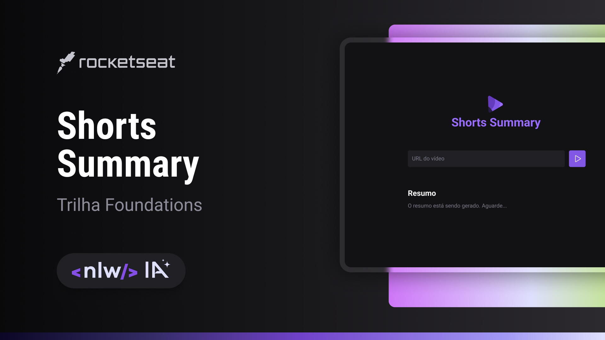

# Shorts Summary

> Shorts Summary é uma aplicação web para criar resumo de vídeos shorts do Youtube utilizando Inteligência Artificial para transcrever o conteúdo do vídeo e realizar o resumo do conteúdo. Esse projeto é desenvolvido na trilha Foundations na edição NLW IA.

## 🚀 Tecnologias

- HTML
- CSS
- JavaScript
- AI
  - Whisper
  - Bart 

## 🎨 Layout

O protótipo do projeto pode ser encontro no [Figma](https://www.figma.com/file/HgSvVzQrA47AHztsvUwv8y/Shorts-Summary-%E2%80%A2-Trilha-Foundations-(Community)?type=design&node-id=0%3A1&mode=design&t=uZHq5LSRpSVYZ5Dd-1)

## 📝 Aprendizados

Neste projeto proposto pela [Rocketseat](https://www.rocketseat.com.br/) de forma gratuita, aprendemos a desenvolver o Front End e Back End da aplicação que utiliza **Inteligência Artificial**
para transcrever o Shorts do YouTube e resumi-lo.

## Autores

- [@denniscosta13](https://github.com/denniscosta13) 

## 🤝 Agradecimentos

Agradecimentos ao [Rodrigo Gonçalves](https://github.com/rodrigorgtic) que nos guiou durante esses 3 dia de código e também a [Rocketseat](https://www.rocketseat.com.br/)
por proporcionar tudo isso

## 📝 Licença

Esse projeto está sob licença. Veja o arquivo [MIT](https://choosealicense.com/licenses/mit/) para mais detalhes.
